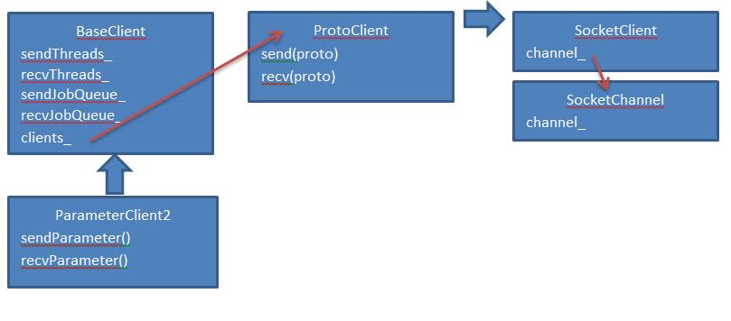

## 安装Paddle

### 下载paddle镜像 
	docker pull paddledev/paddle:cpu-demo-latest

### 启动Paddle容器 
	docker run -it paddledev/paddle:cpu-demo-latest
	cd /root/paddle

## 单机运行Paddle 

	cd demo/recommendation
	sh run.sh

## Debug paddle 
执行下面命令

	export DEBUGGER="gdb --args"
	cd demo/recommendation
	sh run.sh
如果没有安装gdb，执行命令
	apt-get install gdb

分布式运行可以去节点上通过gdb --pid命令debug

## 分布式运行

### 准备环境

安装sshd:

	apt-get install openssh-server
	/etc/init.d/ssh start
	ssh-keygen -t rsa

运行另一个paddle容器并准备ssh环境

	docker run -it paddledev/paddle:cpu-demo-latest
	apt-get install openssh-server
	/etc/init.d/ssh start
	ssh-keygen -t rsa

把两个容器的key加入到~/.ssh/authorized_keys

### 启动分布式paddle
	cd paddle/scripts/cluster_train

修改conf.py

	HOSTS = [
        "root@172.17.0.7",
        "root@172.17.0.8",
        ]
	export PATH_TO_LOCAL_WORKSPACE=/root/paddle/demo/recommendation
	sh run.sh

root@172.17.0.7上的启动命令是：

	[root@172.17.0.7] run: cd /home/paddle/JOB20160831115853; GLOG_logtostderr=0 GLOG_log_dir="./log" nohup paddle pserver  --num_gradient_servers=2 --nics=eth0 --port=7164 --ports_num=2 --ports_num_for_sparse=2 --comment=paddle_process_by_paddle > ./log/server.log 2>&1 < /dev/null &
	[root@172.17.0.7] run: cd /home/paddle/JOB20160831115853; GLOG_logtostderr=0 GLOG_log_dir="./log" nohup paddle train  --num_gradient_servers=2 --nics=eth0 --port=7164 --ports_num=2 --comment=paddle_process_by_paddle --pservers=172.17.0.7,172.17.0.8  --ports_num_for_sparse=2 --config=./trainer_config.py --trainer_count=4 --use_gpu=0 --num_passes=10 --save_dir=./output --log_period=50 --dot_period=10 --saving_period=1 --local=0 --trainer_id=0 > ./log/train.log 2>&1 < /dev/null &
root@172.17.0.8上的启动命令是：

	[root@172.17.0.8] run: cd /home/paddle/JOB20160831115853; GLOG_logtostderr=0 GLOG_log_dir="./log" nohup paddle pserver  --num_gradient_servers=2 --nics=eth0 --port=7164 --ports_num=2 --ports_num_for_sparse=2 --comment=paddle_process_by_paddle > ./log/server.log 2>&1 < /dev/null &
	[root@172.17.0.8] run: cd /home/paddle/JOB20160831115853; GLOG_logtostderr=0 GLOG_log_dir="./log" nohup paddle train  --num_gradient_servers=2 --nics=eth0 --port=7164 --ports_num=2 --comment=paddle_process_by_paddle --pservers=172.17.0.7,172.17.0.8  --ports_num_for_sparse=2 --config=./trainer_config.py --trainer_count=4 --use_gpu=0 --num_passes=10 --save_dir=./output --log_period=50 --dot_period=10 --saving_period=1 --local=0 --trainer_id=1 > ./log/train.log 2>&1 < /dev/null &

Paddle的架构如上图所示，paddle在每台节点启动PServer和Trainer的两个进程。

### PServer进程

PServer进程：入口paddle/pserver/ParameterServer2Main.cpp

在paddle/pserver/ParameterServer2Main.cpp:34看到启动ParameterServer2的数量

	int numPorts = FLAGS_ports_num + FLAGS_ports_num_for_sparse;

例子中ports_num + ports_num_for_sparse=4

ParameterServer2类继承ProtoServer类继承SocketServer。并在paddle/pserver/LightNetwork.cpp:191 SocketServer::tcpServer会启动tcpserver，接收客户端连接，每个连接创建SocketWorker线程类。SocketWorker类中的channe负责网络收发，并调用handleRequest()处理请求，handleRequest中根据请求的funcName调用相应的函数。主要函数入口有ParameterServer2类的sendParameter()和doOperation()。sendParameter()的作用是处理非同步的请求，如SET_PARAM，GET_PARAM，ASYNC_SGD，ADD_GRADIENT，AVERAGE_PARAMETER。doOperation()的主要作用是处理sync-sgd。

sync-sgd时，客户端通过controller线程发送op_SGD 命令到PServer，然后立即发送sendParameter请求，PServer端通过doOperation()和sendParameter()调用完成sync-sgd的梯度合并和优化。

<table>
<tbody>
<tr><td>并行方式</td><td>区别<td><tr>
<tr><td>sync-sgd</td><td>Client通过controller和所有pservers建立连接，传输数据需要barrier同步，发送和merge梯度都是以block为单位，节省网络开销<td><tr>
<tr><td>async-sgd</td><td>Client不同pservers的连接不需要barrie同步，梯度立即发送<td><tr>
</tbody>
</table>

SocketWorker类有2个成员变量，channel负责网络收发，server负责处理请求。

	std::unique_ptr<SocketChannel> channel_;
	SocketServer* server_;

### Trainer进程 ###
主线程的堆栈

	Thread 1 (Thread 0x7f60c34f4780 (LWP 1893)):
	#0  sem_wait () at ../nptl/sysdeps/unix/sysv/linux/x86_64/sem_wait.S:85
	#1  0x0000000000619ff3 in wait (this=<optimized out>) at /root/paddle/paddle/utils/Locks.h:144
	#2  waitOutArgsReady ()
	at /root/paddle/paddle/gserver/gradientmachines/MultiGradientMachine.h:367
	#3  paddle::MultiGradientMachine::getOutArgs ()
	at /root/paddle/paddle/gserver/gradientmachines/MultiGradientMachine.cpp:357
	#4  0x0000000000618a3e in paddle::MultiGradientMachine::forwardBackward()
	at /root/paddle/paddle/gserver/gradientmachines/MultiGradientMachine.cpp:291
	#5  0x000000000066205c in paddle::TrainerInternal::forwardBackwardBatch()
	at /root/paddle/paddle/trainer/TrainerInternal.cpp:299
	#6  0x0000000000662ab7 in paddle::TrainerInternal::trainOneBatch ()
	at /root/paddle/paddle/trainer/TrainerInternal.cpp:117
	#7  0x000000000065da30 in paddle::Trainer::trainOnePass ()
	at /root/paddle/paddle/trainer/Trainer.cpp:434
	#8  0x0000000000661247 in paddle::Trainer::train ()
	at /root/paddle/paddle/trainer/Trainer.cpp:280
	#9  0x000000000050b083 in main ()
	at /root/paddle/paddle/trainer/TrainerMain.cpp:100

主线程初始化会启动FLAGS_trainer_count个TrainerThread，例子中是4个paddle/gserver/gradientmachines/MultiGradientMachine.cpp:134

TrainerThread负责真正的计算，主线程通过getOutArgs()等待计算结果。

主线程会设置updateCallback，在回调中向PServer更新参数。

更新参数是异步的，主线程中会创建SparseRemoteParameterUpdater和RemoteParameterUpdater两个线程。跟启动参数中ports_num+ports_num_for_sparse对应。可以看出Sparse和非Sparse是分开的。

RemoteParameterUpdater类和SparseRemoteParameterUpdater类中创建ParameterClient2类负责网络收发。

BaseClient类中启动一组接收线程，接收队列，发送线程，发送队列，数量等于实际PServer数量。

	/// nodes * ports that means the number of real pservers
	int serviceNum_;

假如有n个PServer进程，sendParameter()把参数或数据放到n个sendJobQueue_里面，n个sendThread_从各自的sendJobQueue_取出并同时发送到n个PServer。避免网络拥塞。以下是代码中原话，作者假设pserver最多就几百个，这种基于线程的并行方式是有效的，对于更大的集群，可能会有问题。

	/**
	 * threads num for managing all services. Normally the
	 * number of pservers are relatively less than several
	 * hundreds so that using thread-based parallelization
	 * can benifit traffic performance and pserver's sgd
	 * optimization performance.
	 */
	int threadNum_;

ParameterUpdaterCreators根据配置文件创建相应的ParameterUpdater。

SgdThreadUpdater，SgdLocalUpdater，SgdUpdaterWithCpuAverager是local的ParameterUpdater，不需要连接PServer。其他的是remote的ParameterUpdater需要连接PServer。

在Trainer::init paddle/trainer/Trainer.cpp:240中，初始化ParameterUpdater，
trainerInternal_.getParameterUpdater()->init(parameters);

Local的ParameterUpdater类在forward()前调用startBatch()，在backward后调用finishBatch()，在forward()和backward()中会多次调用update()更新weight。ParameterUpdater类的startBatch()， finishBatch()，update()主要调用ParameterOptimizer的同名函数。

Remote的ParameterUpdater类主要区别在于finishBatch()中会跟PServer更新参数。

SparseRemoteParameterUpdater所有参数都在PServer端，所以不需要localUpdater_，它的updateImpl实现是空的。在forward()前要从PServer拉weight,每次只拉需要的部分，所以参数可以非常大。在finishBatch()中，调用sendAndReceiveParameter发送delta到PServer，并拉取最新的参数。controller()线程函数中通过PSERVER_OP_START_PASS，PSERVER_OP_SGD，PSERVER_OP_FINISH_PASS操作命令在服务器端更新参数。

ConcurrentRemoteParameterUpdater在RemoteParameterUpdater基础上加了一个优化：

	pipeline device-to-host copy and host-to-network to hide network latency in backward stage.

并且在不同的线程里面发送和接收。参数可以在本地也可以在PServer端，如果在本地通过localUpdater_更新，如果在PServer端通过controllerThread_更新(猜的，不知道对不对？)

